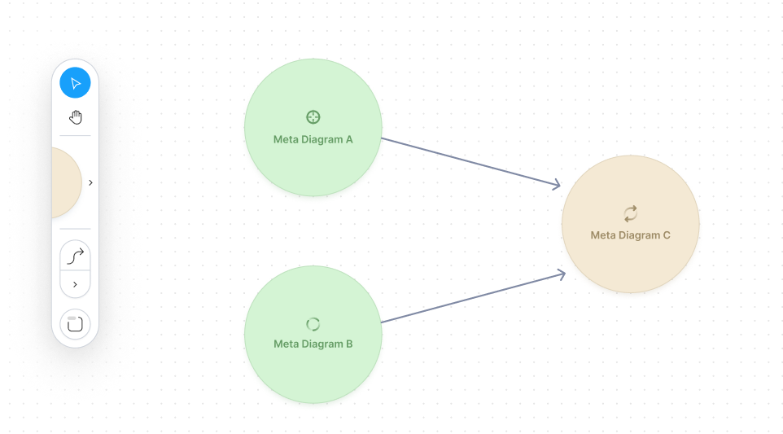

# meta-diagram

Simple diagramming workspace library

## Screenshot




## Install 

```
npm i @metacell/meta-diagram

// or if using yarn
yarn add @metacell/meta-diagram
```

## Usage

TBD

## Props

| name          | type                                                                                  | required | description                                                                                    |
|---------------|---------------------------------------------------------------------------------------|----------|------------------------------------------------------------------------------------------------|
| metaDiagrams  | MetaDiagram[]                                                                         | true     | array of MetaDiagram instances to be render                                                    |
| metaLinks     | MetaLink[]                                                                            | true     | array of MetaLink instances to be render                                                       |
| componentsMap | { nodes: [key: string]: React.elementType,  links: [key: string]: React.elementType } | true     | dictionary to connect application specific types with React elements to render for those types |


## Development

### Commands

TSDX scaffolds the library inside `/src`, and also sets up a [Parcel-based](https://parceljs.org) playground for it inside `/example`.

The recommended workflow is to run TSDX in one terminal:

```bash
npm start # or yarn start
```

This builds to `/dist` and runs the project in watch mode so any edits you save inside `src` causes a rebuild to `/dist`.

Then run the example inside another:

```bash
cd example
npm i # or yarn to install dependencies
npm start # or yarn start
```

The default example imports and live reloads whatever is in `/dist`, so if you are seeing an out of date component, make sure TSDX is running in watch mode like we recommend above. **No symlinking required**, we use [Parcel's aliasing](https://parceljs.org/module_resolution.html#aliases).

To do a one-off build, use `npm run build` or `yarn build`.

To run tests, use `npm test` or `yarn test`.


## Continuous Integration

### GitHub Actions

Two actions are added by default:

- `main` which installs deps w/ cache, lints, tests, and builds on all pushes against a Node and OS matrix
- `size` which comments cost comparison of your library on every pull request using [`size-limit`](https://github.com/ai/size-limit)


### Publishing to NPM

TBD [np](https://github.com/sindresorhus/np).
